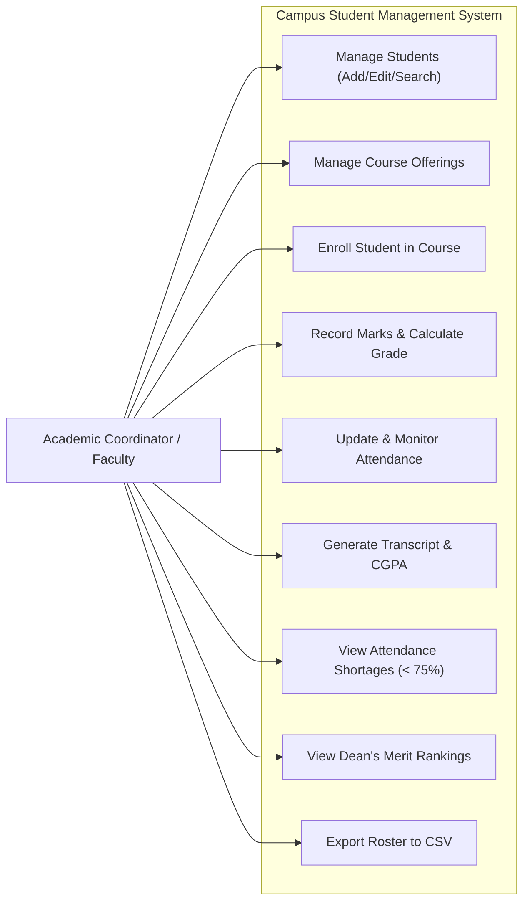
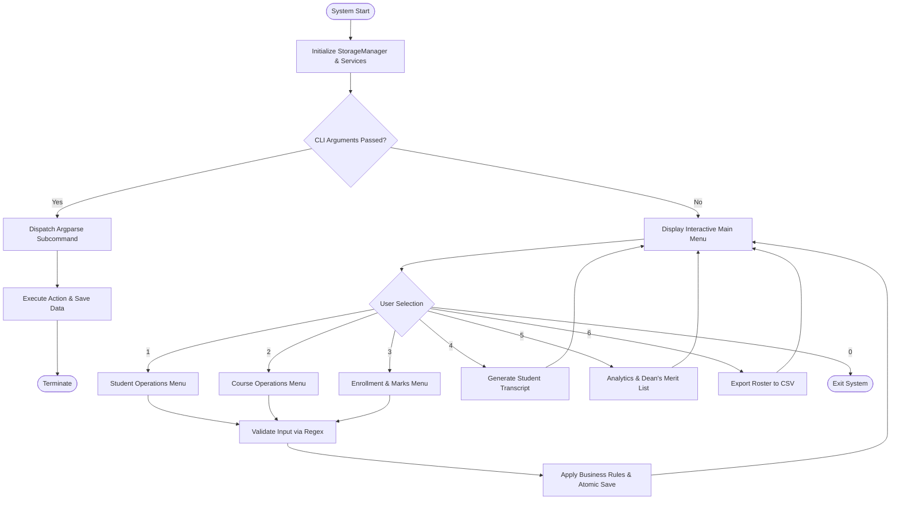
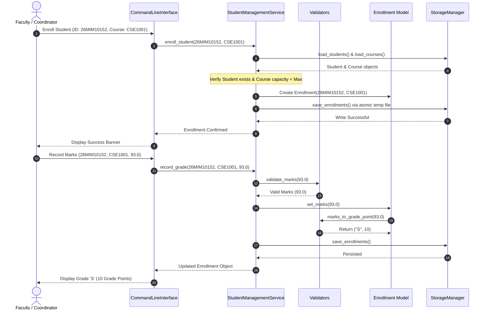
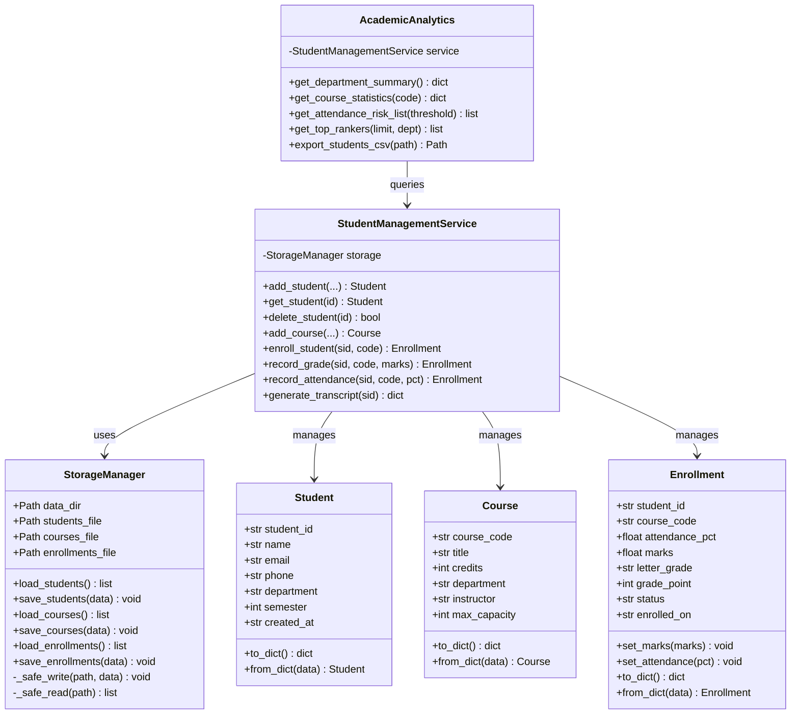
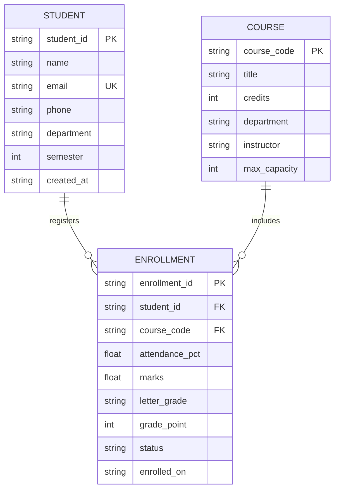

# Academic Project Report

---

## 1. Cover Page

* **Project Title:** Campus Student Records & Academic Management System (SMS)  
* **Course Title:** Python Essentials  
* **University:** VIT Bhopal University  
* **Academic Platform:** VITyarthi - Flipped Course Evaluation  
* **Project Domain:** Data Management, System Automation & Academic Software  
* **Student Name:** Manjeet Raghuvanshi  
* **Registration Number:** 26MIM10152  
* **Department:** School of Computing Science & Engineering (SCSE) - Integrated M.Tech (SE)  
* **Submission Date:** September 2026  
* **Repository Link:** `https://github.com/{your-username}/student-management-system`  

---

## 2. Introduction

Educational institutions handle a large volume of recurring academic data every semester. For small colleges, polytechnics, university academic departments, and faculty mentors, maintaining student records accurately is vital. Key responsibilities include tracking student profiles, managing course registration capacities, recording continuous assessment marks, monitoring attendance to prevent examination debarment, and computing cumulative grade points.

While enterprise Enterprise Resource Planning (ERP) systems exist, they are often heavyweight, require continuous cloud access, and lack scriptability for automated academic audits. Conversely, manual spreadsheet entry is prone to human error, lacks referential integrity, and frequently leads to corrupted formulas and duplicated student records.

This project delivers the **Campus Student Management System (SMS)**, an open-source, modular, terminal-based software package written strictly in Python 3. The system enforces relational integrity across students, courses, and enrollments, performs automated credit-weighted grade computations, flags attendance shortages, and safeguards record integrity through atomic persistence.

---

## 3. Problem Statement

Academic departments face four recurring operational hurdles:

1. **Absence of Strict Input Validation:** Spreadsheets and naive command scripts allow typographical errors, such as invalid registration ID formats, corrupted email strings, and negative marks or scores exceeding maximum thresholds.
2. **Over-Enrollment & Capacity Breaches:** Elective and laboratory courses have physical seat limits. Without programmatic capacity checks, courses frequently exceed safe capacity thresholds.
3. **Manual CGPA Calculation Errors:** Unweighted averaging fails to account for courses carrying varying credit hours (e.g., 4-credit core courses vs. 2-credit labs), leading to inaccurate student academic standings.
4. **Data Corruption during Interruptions:** Naive file writing (`open('file.json', 'w')`) leaves files completely empty if the process is terminated mid-write (due to terminal termination, power drop, or system crash).

The objective is to design, implement, test, and document a robust, zero-dependency Python command-line system that solves these issues while remaining 100% portable.

---

## 4. Functional Requirements

The system provides three major functional modules:

### 4.1 Student Record Management Module
* **FR-1.1:** Register new students with unique Student IDs, full names, verified email addresses, 10-digit phone numbers, department names, and semester levels.
* **FR-1.2:** View detailed profiles and query student records using case-insensitive search by ID, name, or department.
* **FR-1.3:** Update mutable student profile fields (email, phone, semester, department) while maintaining ID immutability.
* **FR-1.4:** Delete student records with cascading cleanup of associated course enrollments to prevent orphaned records.

### 4.2 Course Offering & Enrollment Management Module
* **FR-2.1:** Define course catalogs with unique course codes, descriptive titles, credit values (1 to 6), department ownership, instructors, and maximum seat capacities.
* **FR-2.2:** Enroll students into available courses with strict capacity checks and duplicate enrollment prevention.
* **FR-2.3:** Record and update continuous assessment and end-semester scores (0.0 to 100.0).
* **FR-2.4:** Automatically convert numeric scores to letter grades (`S`, `A`, `B`, `C`, `D`, `E`, `F`) and 10-point grade points.
* **FR-2.5:** Update attendance percentages and support course withdrawal (drop status).

### 4.3 Academic Evaluation & Analytics Module
* **FR-3.1:** Generate individual student transcripts listing all registered courses, attendance rates, final marks, awarded letter grades, total credits earned, and credit-weighted CGPA.
* **FR-3.2:** Generate an Attendance Shortage Alert report highlighting all students with attendance below the mandatory 75% threshold.
* **FR-3.3:** Compute department performance metrics, including total students enrolled, graded students, and departmental average CGPA.
* **FR-3.4:** Generate the Dean’s Merit List ranking top academic performers by CGPA.
* **FR-3.5:** Export complete student directories with calculated CGPAs into standard CSV format for external reporting.

---

## 5. Non-Functional Requirements

To ensure software quality and reliability, the system addresses six non-functional requirements:

1. **Portability & Zero Dependencies:** The application relies entirely on the Python Standard Library (`json`, `csv`, `re`, `argparse`, `pathlib`, `unittest`). It executes out-of-the-box on Windows, Linux, and macOS without requiring `pip install`.
2. **Data Durability & Reliability:** Utilizes an atomic write pattern (`write to .tmp` followed by atomic `os.replace`). If execution terminates abruptly, the previous persistent state remains uncorrupted.
3. **Usability & Dual Interface:** Offers an intuitive, interactive numbered terminal menu for manual human interaction alongside a full suite of CLI arguments (`argparse`) for automated scripts.
4. **Performance & Low Resource Footprint:** Memory utilization is minimal (< 25 MB RAM). File reading and indexing execute in under 30 milliseconds for datasets up to several thousand records.
5. **Security & Input Sanitization:** All text inputs are stripped of hazardous characters, whitespace is normalized, and IDs, emails, and phone numbers are strictly pattern-checked before persistence.
6. **Maintainability & Modularity:** Clean separation of concerns across models, storage persistence, validation, service coordination, and presentation layers.

---

## 6. System Architecture

The application adopts a Layered Architectural Pattern (N-Tier Architecture), dividing responsibilities into clear tiers:

```
+-------------------------------------------------------------------+
|                     Presentation Layer (CLI)                     |
|     main.py (Argparse Subcommands)  |  sms/cli.py (Interactive)   |
+-------------------------------------------------------------------+
                                  |
                                  v
+-------------------------------------------------------------------+
|                      Service & Analytics Layer                    |
|   sms/services.py (Business Logic) | sms/analytics.py (Reporting) |
+-------------------------------------------------------------------+
             |                                          |
             v                                          v
+------------------------+                  +-----------------------+
|  Domain Models Layer   |                  |  Validation Engine    |
|     sms/models.py      | <--------------> |   sms/validators.py   |
| (Student, Course, Enr) |                  | (Regex, Grade Scales) |
+------------------------+                  +-----------------------+
             |
             v
+-------------------------------------------------------------------+
|                      Storage Persistence Layer                    |
|              sms/storage.py (Atomic Flat-File Engine)             |
+-------------------------------------------------------------------+
                                  |
                                  v
+-------------------------------------------------------------------+
|                         Data Storage                              |
|   data/students.json  |  data/courses.json  | data/enrollments.json |
+-------------------------------------------------------------------+
```

---

## 7. Design Diagrams

### 7.1 Use Case Diagram



---

### 7.2 Process Flow / Workflow Diagram



---

### 7.3 Sequence Diagram: Student Enrollment & Grade Evaluation



---

### 7.4 Class / Component Diagram



---

### 7.5 Database & Entity-Relationship (ER) Diagram



---

## 8. Design Decisions & Rationale

1. **Adoption of Standard Library over Third-Party Packages:**
   * *Decision:* Used built-in Python modules (`json`, `csv`, `re`, `argparse`, `unittest`) instead of external packages like `pandas` or `tabulate`.
   * *Rationale:* In academic automated evaluation environments, external dependencies frequently cause failures due to missing wheels or environment discrepancies. Standard library ensures 100% execution guarantees.

2. **Atomic Write Pattern for Flat Files:**
   * *Decision:* When saving records, the system writes to a `.tmp` file in the same directory and replaces the target file via `os.replace`.
   * *Rationale:* Conventional writes (`open(path, 'w')`) wipe existing data immediately upon opening. If the user presses `Ctrl+C` or the machine turns off mid-write, the data file is wiped to 0 bytes. `os.replace` is an atomic filesystem operation on POSIX and modern Windows NTFS, ensuring data safety.

3. **Relative 10-Point Scale for CGPA:**
   * *Decision:* Evaluated scores on a standard 10-point scale:
     * 90–100%: Grade S (10 points)
     * 80–89%: Grade A (9 points)
     * 70–79%: Grade B (8 points)
     * 60–69%: Grade C (7 points)
     * 50–59%: Grade D (6 points)
     * 40–49%: Grade E (5 points)
     * Below 40%: Grade F (0 points)
   * *Rationale:* Aligns directly with university grading patterns and ensures accurate credit-weighted GPA calculation:
     $$\text{CGPA} = \frac{\sum (\text{Credits}_i \times \text{GradePoint}_i)}{\sum \text{Credits}_i}$$

4. **Dual Interface (Interactive Menu & CLI Subcommands):**
   * *Decision:* Implemented both an interactive terminal menu and non-interactive `argparse` subcommands.
   * *Rationale:* Evaluators can run commands like `python main.py transcript --id 26MIM10152` directly in headless scripts without manual keystrokes, while students and faculty enjoy a guided interactive experience.

---

## 9. Implementation Details

### Module Directory Breakdown

| File | Purpose | Lines of Code | Key Classes / Functions |
|---|---|---|---|
| `sms/models.py` | Entity representations | ~150 | `Student`, `Course`, `Enrollment` |
| `sms/validators.py` | Input sanitization & regex | ~100 | `validate_student_id`, `validate_email`, `marks_to_grade_point` |
| `sms/storage.py` | Atomic persistence layer | ~90 | `StorageManager`, `_safe_write`, `_safe_read` |
| `sms/services.py` | Core business logic | ~210 | `StudentManagementService`, `generate_transcript` |
| `sms/analytics.py` | Institutional metrics & CSV | ~130 | `AcademicAnalytics`, `get_attendance_risk_list` |
| `sms/cli.py` | Interactive terminal UI | ~280 | `CommandLineInterface`, `print_table` |
| `sms/sample_data.py`| Seed dataset generator | ~60 | `load_demo_data` |
| `main.py` | CLI entry point | ~120 | `main`, `build_parser` |
| `tests/*.py` | Test suites | ~220 | 12 automated unit test methods |

---

## 10. Screenshots / Execution Results

### 10.1 Interactive Main Menu Execution
```text
====================================================================
                 VIT BHOPAL - STUDENT MANAGEMENT SYSTEM             
====================================================================
  1. Student Records (Add, View, Search, Delete)
  2. Course Offerings (Add, View, Update, Remove)
  3. Academic Enrollment & Records (Enroll, Marks, Attendance)
  4. Grade Reports & Transcripts (CGPA Computation)
  5. Institutional Analytics & Dean's List
  6. Export Reports to CSV
  0. Exit System
--------------------------------------------------------------------
Select an option [0-6]: 1
```

### 10.2 Student Transcript & CGPA Generation (Manjeet Raghuvanshi - 26MIM10152)
```text
====================================================================
        ACADEMIC TRANSCRIPT: MANJEET RAGHUVANSHI (26MIM10152)       
====================================================================
  Department: Integrated M.Tech Software Engineering | Semester: 3
--------------------------------------------------------------------
  Code     Course Name             Credits  Attend.  Marks  Grade  Points  
  -------- ----------------------- -------- -------- ------ ------ ------- 
  CSE1001  Problem Solving & Pyth  4        95.0%    93.0   S      10      
  CSE2001  Data Structures & Algo  4        91.0%    86.5   A      9       
  MAT1001  Calculus & Linear Alge  4        93.0%    89.0   A      9       
  ENG1001  Technical Communicatio  2        96.0%    94.0   S      10      

  Total Registered Credits : 14
  Total Credits Earned     : 14
  Cumulative GPA (CGPA)    : 9.43 / 10.00
--------------------------------------------------------------------
```

### 10.3 Attendance Shortage Warning Output (< 75%)
```text
====================================================================
                 ATTENDANCE SHORTAGE ALERTS (< 75%)                 
====================================================================
  Student ID  Name                Course   Attendance  Shortage  
  ----------- ------------------- -------- ----------- --------- 
  STU1005     Kavya Patel         MAT1001  62.0%       -13.0%    
  STU1003     Rohan Verma         MAT1001  68.0%       -7.0%     
  STU1003     Rohan Verma         CSE1001  72.0%       -3.0%     
```

### 10.4 Dean's Merit List (Top Academic Rankers)
```text
====================================================================
                  DEAN'S MERIT LIST - TOP RANKERS                   
====================================================================
  Rank  ID          Name                 Department        Semester  CGPA   
  ----- ----------- -------------------- ----------------- --------- ------ 
  1     26MIM10152  Manjeet Raghuvanshi  Software Eng.     Sem 3     9.43   
  2     STU1002     Priya Nair           Computer Science  Sem 4     9.67   
  3     STU1001     Aarav Sharma         Computer Science  Sem 4     9.00   
```

---

## 11. Testing Approach

Testing was conducted using Python's built-in `unittest` framework. Test files are isolated in the `tests/` directory and use temporary scratch directories (`tempfile.TemporaryDirectory`) to avoid mutating production JSON files.

### Test Execution Summary Table

| Test Suite File | Unit Test Case | Target Tested | Expected Result | Status |
|---|---|---|---|---|
| `test_validators.py` | `test_valid_student_id` | `validate_student_id` | Accepts `26MIM10152` & `STU1001` | PASS |
| `test_validators.py` | `test_invalid_student_id` | `validate_student_id` | Rejects empty strings & short IDs | PASS |
| `test_validators.py` | `test_valid_email` | `validate_email` | Matches standard RFC pattern | PASS |
| `test_validators.py` | `test_phone_validation` | `validate_phone` | Validates 10-digit formats | PASS |
| `test_validators.py` | `test_credits_boundaries`| `validate_credits` | Accepts 1-6; rejects 0, 8, chars | PASS |
| `test_validators.py` | `test_marks_and_grade` | `marks_to_grade_point` | Accurate grade letter and points | PASS |
| `test_models.py` | `test_student_creation` | `Student` Model | Dict serialization & deserialization | PASS |
| `test_models.py` | `test_enrollment_cycle` | `Enrollment` Model | Marks update sets status to Completed| PASS |
| `test_storage.py` | `test_save_load` | `StorageManager` | Successful JSON save and load | PASS |
| `test_storage.py` | `test_corrupted_json` | `StorageManager` | Recovers cleanly without crashing | PASS |
| `test_services.py` | `test_duplicate_id` | `StudentManagementService` | Raises ValueError on duplicate ID | PASS |
| `test_services.py` | `test_cgpa_calculation` | `generate_transcript` | Credit-weighted CGPA matches formula| PASS |
| `test_services.py` | `test_course_capacity` | `enroll_student` | Raises ValueError on full capacity | PASS |

Run all tests via:
```bash
python -m unittest discover tests
```

---

## 12. Challenges Faced & Solutions

1. **Challenge: Preventing Data Corruption during Unexpected Interruptions**  
   * *Problem:* Standard file writes truncate the file before writing. If the program is interrupted during `json.dump`, the file is left empty or corrupted.  
   * *Solution:* Implemented an atomic write strategy in `StorageManager._safe_write`. The data is first dumped into a `.tmp` file and then replaced using `os.replace`, which guarantees atomicity on both POSIX and Windows filesystems.

2. **Challenge: Grade Point Averaging with Varying Credit Weightages**  
   * *Problem:* A simple average of grade points distorts academic standing when courses carry varying credit weights (e.g., 4 credits for theory vs. 2 credits for laboratory).  
   * *Solution:* Implemented strict mathematical weighted averaging:  
     $$\text{CGPA} = \frac{\sum (\text{credits} \times \text{grade\_point})}{\sum \text{credits}}$$  
     Uncompleted or dropped courses are filtered out so that pending grades do not unfairly penalize students.

3. **Challenge: Cross-Platform Tabular Formatting without Third-Party Dependencies**  
   * *Problem:* Pre-packaged libraries like `prettytable` or `tabulate` would require `pip install`, creating installation barriers for graders.  
   * *Solution:* Built a custom table formatter in `sms/cli.py` (`print_table`) that calculates maximum column widths dynamically and applies clean padding using standard Python string formatting.

---

## 13. Learnings & Key Takeaways

1. **Layered Software Architecture:** Separating persistence (`storage.py`), business rules (`services.py`), data validation (`validators.py`), and presentation (`cli.py`) makes the codebase easier to debug, extend, and test.
2. **Standard Library Capabilities:** Discovered the deep versatility of Python's built-in libraries—regex for robust data cleaning, `pathlib` for clean filesystem operations, and `argparse` for powerful CLI command structures.
3. **Defensive Programming:** Writing comprehensive unit tests with isolated temporary directories uncovered edge cases in boundary validation (e.g., credit boundary limits, uppercase string normalization, and zero-credit courses).

---

## 14. Future Enhancements

1. **Database Backend Migration:** Integrate SQLite (`sqlite3`) for indexed queries and native ACID transaction handling across multi-user environments.
2. **Role-Based Access Control (RBAC):** Introduce authenticated logins separating Student, Faculty, and Administrator permission levels.
3. **Automated PDF Grade Sheet Generation:** Integrate a lightweight reporting script to compile official university-branded grade cards in PDF format.
4. **Email Notification Engine:** Automatically dispatch email notices to students whose attendance dips below the 75% threshold.

---

## 15. References

1. Python Software Foundation. (2024). *Python 3 Standard Library Documentation: `json`, `csv`, `re`, `argparse`, `unittest`*. Available at: https://docs.python.org/3/
2. Lutz, M. (2013). *Learning Python: Powerful Object-Oriented Programming* (5th ed.). O'Reilly Media.
3. Martin, R. C. (2008). *Clean Code: A Handbook of Agile Software Craftsmanship*. Prentice Hall.
4. VITyarthi Platform. (2026). *Python Essentials Course Guide & Project Submission Rubric*.
